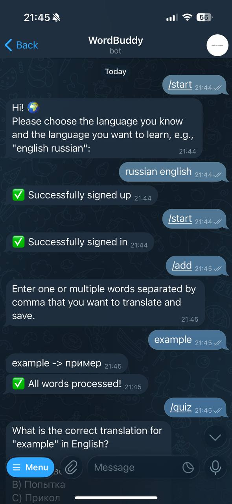
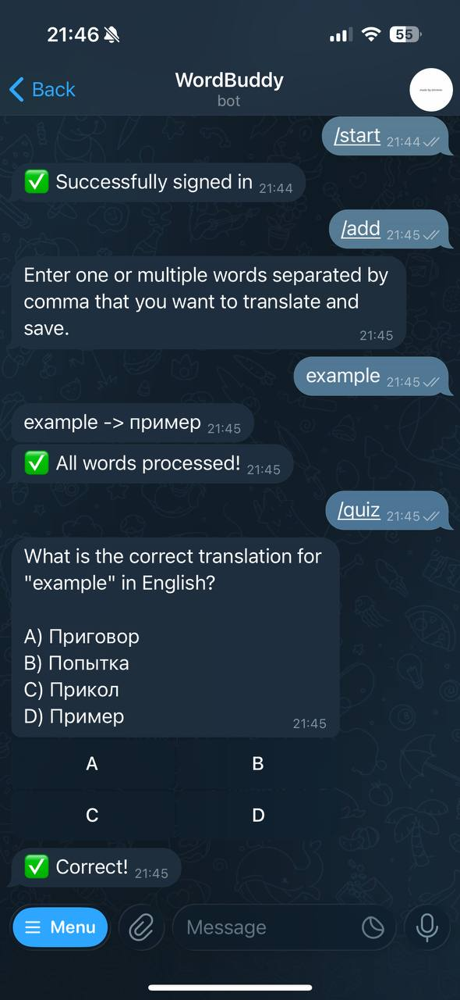

# Word Buddy

***WordBuddy*** is a Telegram bot that helps people learn foreign language vocabulary. It provides per-user word storage and organizes quizzes using an LLM.

## Set Up
Primarily, you need to set up the environment `.env` file.

I've used [Lara Translation API](https://support.laratranslate.com/en//translation-api?utm_term=api%20translation&utm_campaign=LARA+SEM+-+Brand&utm_source=adwords&utm_medium=ppc&hsa_acc=4328324064&hsa_cam=22333471647&hsa_grp=175631979359&hsa_ad=738873862480&hsa_src=g&hsa_tgt=kwd-1597599931575&hsa_kw=api%20translation&hsa_mt=b&hsa_net=adwords&hsa_ver=3&gad_source=1&gad_campaignid=22333471647&gbraid=0AAAAAohNJ6TEt6Yeiak98AKIm0e4pVj0-&gclid=Cj0KCQjwsPzHBhDCARIsALlWNG13vWqDl4cb3P-zSXq_JFPHyJMMcqBYK-L50RKofWDGqcr2ZRKWqhQaAl4IEALw_wcB) for this bot, so you need to get the key, it's free. Also, you need to get the key from [Telegram BotFather](https://telegram.me/BotFather). The last step would be to install [Ollama](https://ollama.com/), you should have at least 8gb of ram to run this.

```sh
# api keys
# your telegram token
TELEGRAM_TOKEN=""
# lara translate token
TRANSLATE_ID=""
TRANSLATE_SECRET=""

# where you want to store your database
DB_PATH="./.data/users.db"

# ollama model you want to use, I used "mistral" due to my 8gb RAM laptop
OLLAMA_MODEL="mistral"
```

## Running

There are several options of how to run this bot, ***Make***, ***Docker*** or ***Kubernetes***.

***Make***
```sh
# make help, to see all available commands
make run
```

***Docker***

Explicitly build and run Dockerfile
```sh
docker build -t wordbuddy:latest .
docker run --rm \
  -e TELEGRAM_TOKEN="YOUR_TELEGRAM_TOKEN" \
  -e TRANSLATE_ID="YOUR_TRANSLATE_ID" \
  -e TRANSLATE_SECRET="YOUR_TRANSLATE_SECRET" \
  -e DB_PATH="YOUR_DATABASE_PATH" \
  -e OLLAMA_MODEL="YOUR_OLLAMA_MODEL" \
  wordbuddy:latest
```

Run docker-compose
``sh
docker compose up --build
``

***Kubernetes***
```sh
kubectl apply -f deployment.yml
```

## Examples


